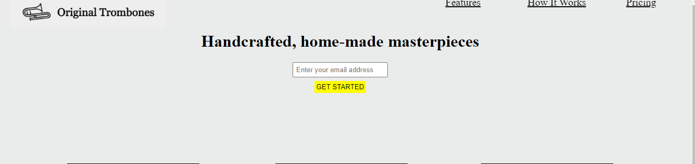

# product-landing-page 🚀

## product-landing-page Description 📝

> it is a simple prodect-landing-page that give you information about a company amd it prodect.


## Demo 📸

Include a demo or animated GIF of your project. You can use tools like [asciinema](https://asciinema.org/) to record your terminal sessions.



## Technologies Used 🛠️

List the technologies or tools you used to develop your project. You can also include the libraries or frameworks you used.

Examples:

- HTML
- CSS

## usage 🎯

## Usage 🎯

clone the project 

```bash
# git clone
```

```bash
# cd (choose a file)
```

```bash
code .
```


## Author 👩‍💻

you can find me on social media platform by these username.

-
- Twitter: [@Breshna Hamidi](https://twitter.com/your-twitter)
- LinkedIn: [Breshnahamidi](https://linkedin.com/in/your-name)
- Email: [breshna2004@gmail.com](mailto:example@gmail.com)

